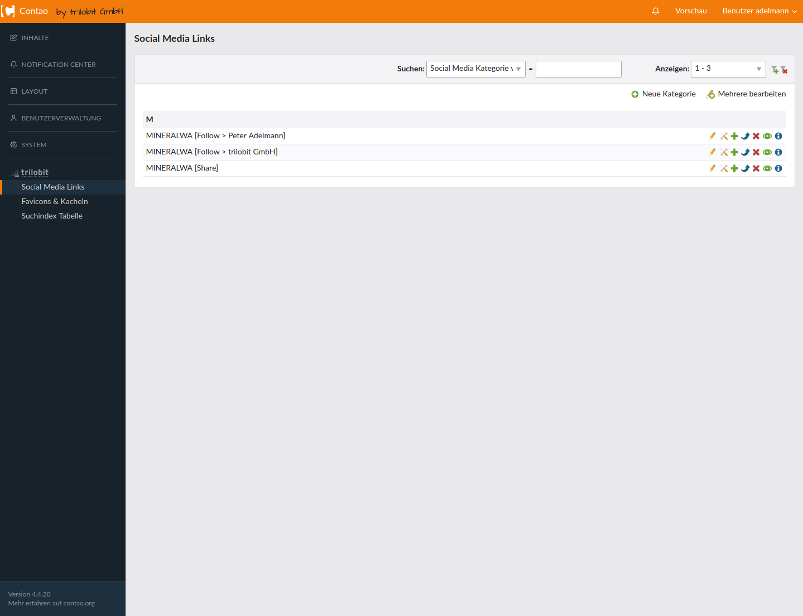
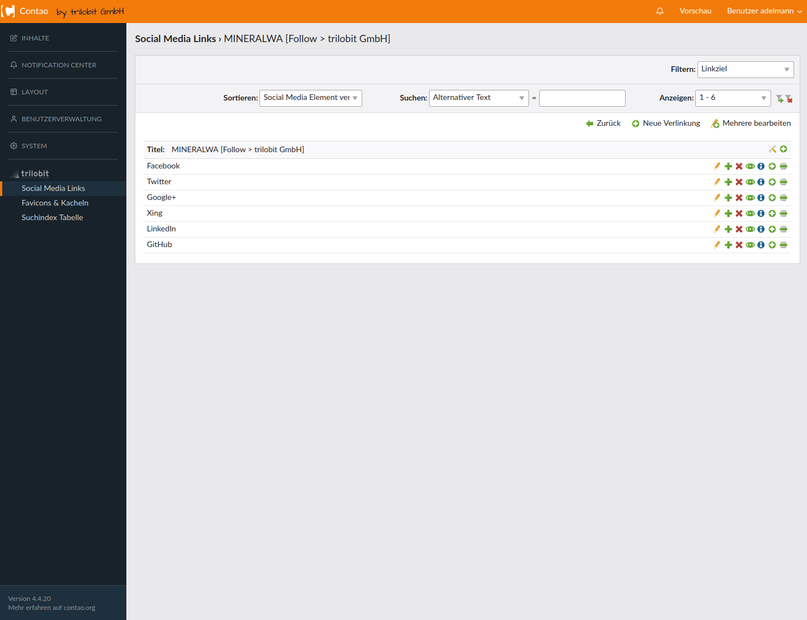
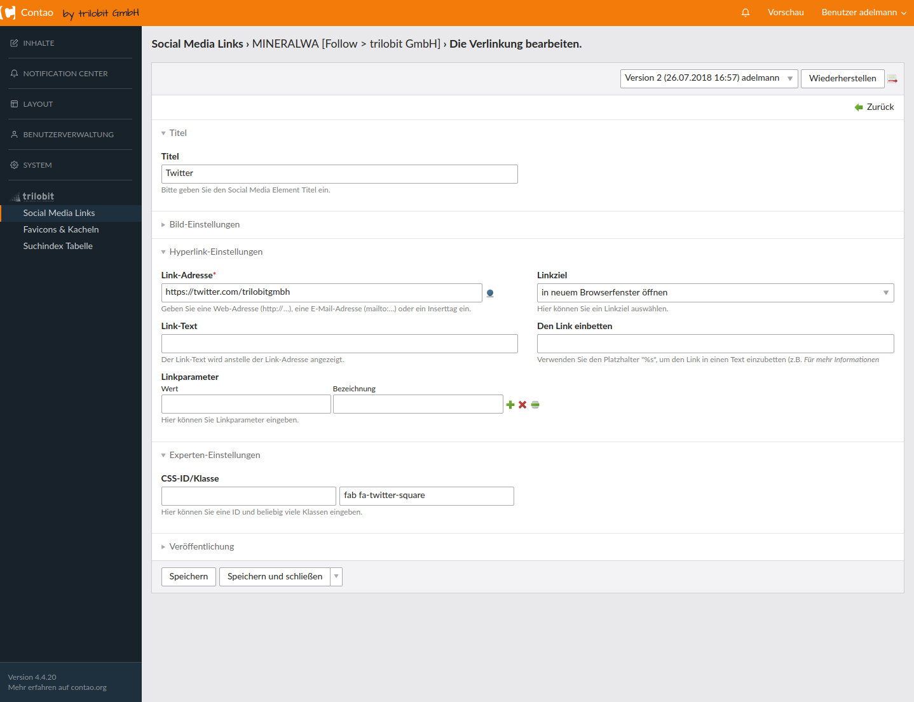
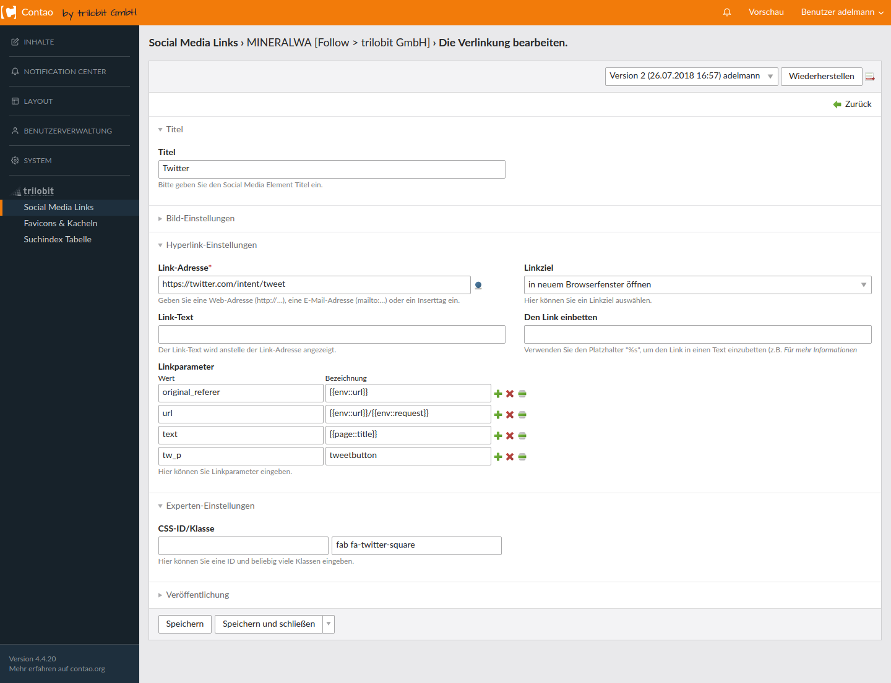

Socialmedia bundle
==================

The Social Media Bundle is basically a wrapper that allows you to bundle different link collections. In addition, images can be included in the links.
To create some comfort, it is possible to attach parameters via Wizard. After a collection or a wrapper has been created, you can create a module for it
and integrate this on any page. The HTML structure used is that of a navigation element.

Socialmedia Bundle
==================

Das Socialmedia Bundle ist im Grunde ein Wrapper, mit dem man verschiedene Linksammlungen bündeln kann. Zusätzlich können bei den Links Bilder eingebunden werden.
Um etwas Komfort zu schaffen ist es möglich, Parameter via Wizard anzuhängen. Nachdem eine Sammlung bzw. ein Wrapper angelegt wurde, kann man ein Modul dafür anlegen
und dieses beliebig auf einer Seite einbinden. Die verwendete HTML-Struktur ist dabei die eines Navigationselementes.

Screenshots
===========

Backend: Liste der Wrapper / Container

Backend: Liste der Einträge eines Wrappers

Backend: Einstellungen eines Eintrags; einfaches "Folgen" in diesem Fall mit FontAwesome-Klassen (Das Ausgabetemplate ist in diesem Fall für das Projekt modifiziert worden)

Backend: Einstellungen eines Eintrags; "Teilen" in diesem Fall mit FontAwesome-Klassen (Das Ausgabetemplate ist in diesem Fall für das Projekt modifiziert worden)

Ausgabe im Frontend; in diesem Fall ein einfaches Follow im Footer

Installation
============

Install the extension via composer: [trilobit-gmbh/contao-socialmedia-bundle](https://packagist.org/packages/trilobit-gmbh/contao-socialmedia-bundle).

Compatibility
=============

* Contao version ~4.4